# 前提知識
- 写像(？)
  - y = f(x)のとき
    - f: 写像(規則？)
    - y: 像
    - x: 原像
- Z: 整数全体の集合
- N: 自然数全体の集合
- Q: 有理数全体の集合
  - 整数p, q(q!=0)についてp/qのように分数で表せる数
- R: 実数全体の集合
- C: 複素数全体の集合
- N⊂Z⊂Q⊂R⊂C

# 線形代数
## ベクトル
- 行数=次元数
- R^d: d次元実ベクトルの集合
- ノルム: ベクトルの大きさ
  - |x|1: L1ノルムは全成分の絶対値の和
  - ||x||: L2ノルムは`√(v1^2 + v2^2 + ...)`
    - ベクトルを空間上で矢印で表記したときの長さに相当する
  - 大体の場合ノルム=L2ノルム

### ベクトルの内積
- u^T v(u,vはベクトル): 内積
  - u1\*v1 + u2\*v2 + ...
  - ||u|| * ||v|| * cosθ

### ベクトルの幾何的イメージ
- (直線の)パラメータ表示(媒介変数表示)
  - 直線上の位置ベクトルを、パラメータtを使って表したもの
  - x = x0 + ta (aは方向ベクトル)
- 原点を通る平面
  - a^T x = 0
  - aは固定されたベクトル(法線ベクトル)
  - 平面に対し垂直であるベクトル
- 点Pを通り法線aである平面
  - a^T (x-p) = 0
  - -a^T p = bとおくと、a^T x - b  = 0
- 平面P(a^T x - b  = 0)と点qの距離
  - |a^T q + b| / ||a||
- ベクトルa, bについて、aからbの射影
  - a^T b / ||b||^2 * b

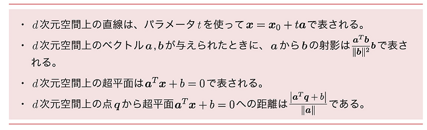

## 行列
### 行列の演算
- 行列とベクトルの積
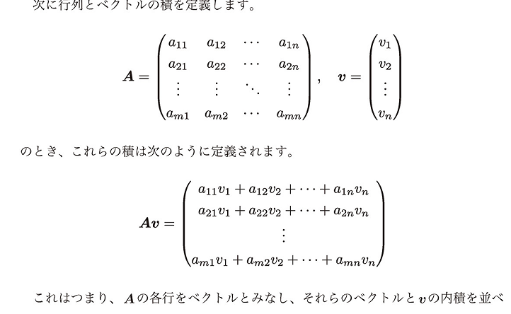
- 行列と行列の積
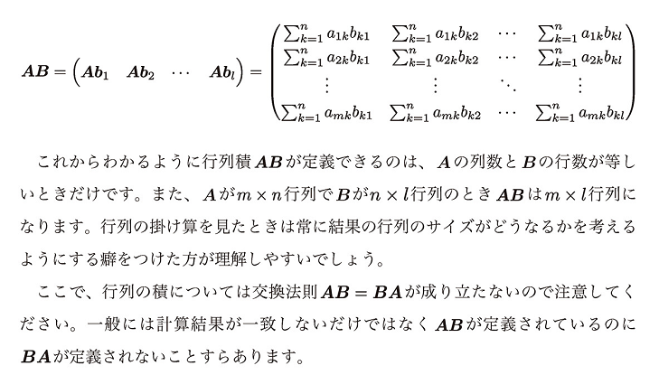
- 転置
  - `A^T`
  - 行と列をひっくり返したもの

### ブロック化による演算の効率化
- ブロック化
  - 行列を更に小さい行列に区切って計算すること
  - 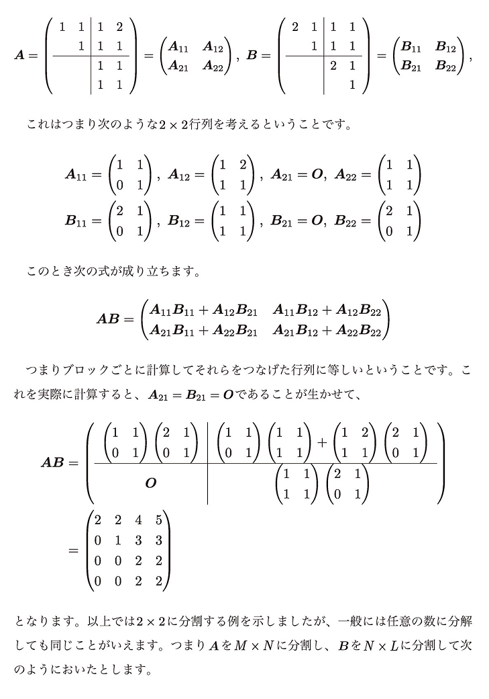

### 逆行列と連立方程式
- 正方行列
  - 行数=列数である行列のこと
  - n次正方行列とかいう
- 対角成分
  - 行列の`(i, i)`成分のこと
- 対角行列
  - 正方行列かつ対角成分以外が全て0である行列のこと
  - `diag(d1, ..., dn)`で表される(dは対角成分)
  - 対角行列同士の積は交換法則が成り立つ
- 単位行列
  - 対角行列かつ対角成分がすべて1の行列
  - `In`(nは次元数)と表される
- 逆行列
  - 行列Aに対し、A^-1 と表される
  - AA^-1 = I であるような行列のこと
  - すべての行列に対し存在するとは限らない
- 2*2行列の逆行列の計算式
  - 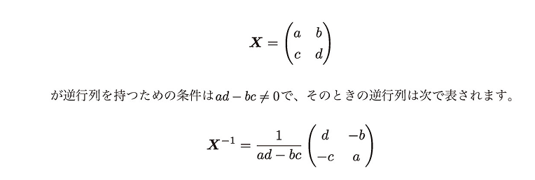
  - 1行目と2行目のベクトルが平行の時逆行列を持たない
- 正則行列
  - 逆行列が存在する正方行列のこと
- 非正則行列
  - 逆行列が存在しない正方行列のこと
- 行列式
  - 逆行列の条件式`ad-bc`のこと
  - `detA`と表される
- 置換行列
  - 各行に1である成分がちょうど1つだけあり、他はすべて0である行列
- 下三角行列
  - 対角成分より右上がすべて0である行列
- 上三角行列
  - 対角成分より左下がすべて0である行列

### 逆行列と線形独立性
- 線形従属・線形独立
  - 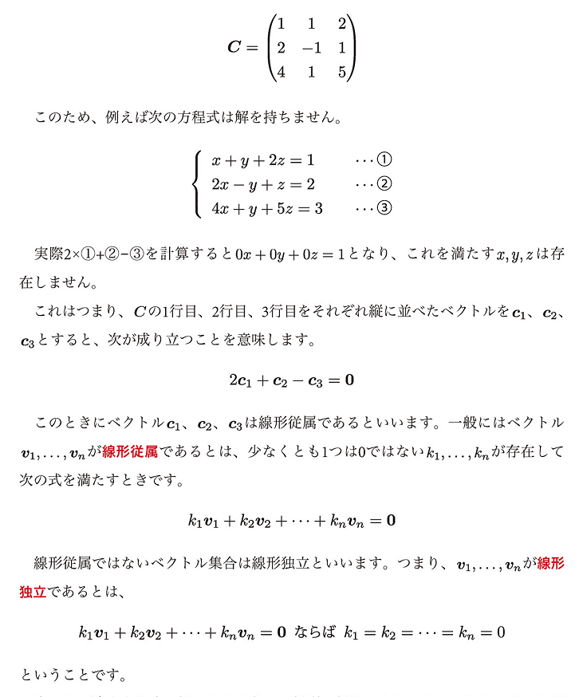
  - 逆行列を持つための一般条件は、行(列)をベクトルと見た時にそれらのベクトルが線形独立であること
- 行基本操作
  - ある行に定数をかける
  - ある行に定数をかけたものを他のある行に足す
  - ある行とある行を交換する
- 逆行列の求め方(手計算非推奨)
  - 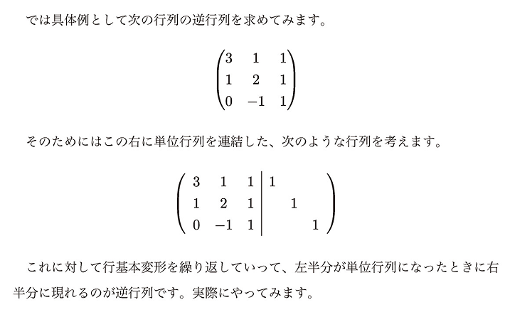
  - 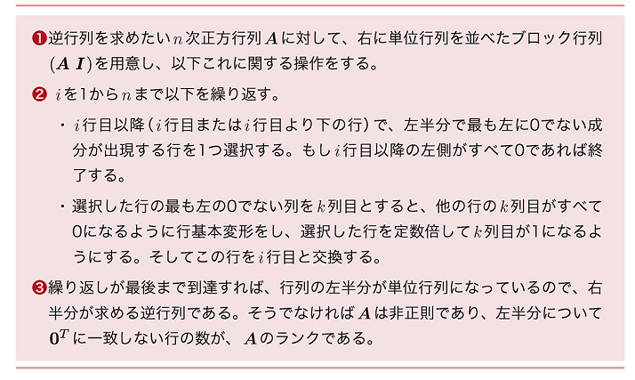
  - 非正則行列に対して行うと、どこかの行(列)がすべて0になって詰む
- ランク
  - 行基本変形をした結果、`0^T(0, 0,...)`と一致しない行の数のこと
  - `rank B=2` とか書く
  - 正方行列に限らない概念
  - 最大でも`min(m, n)`(mとnの大きくない方)は超えない
  - 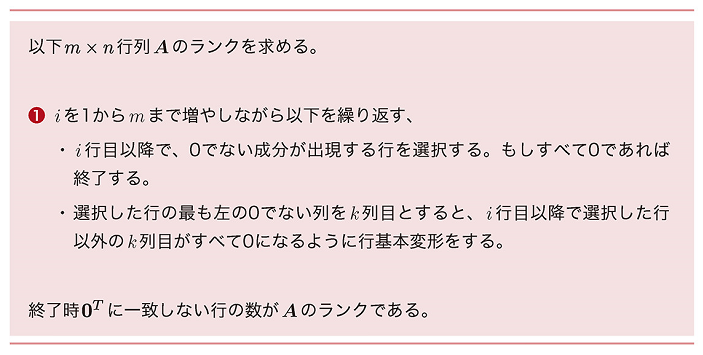
- フルランク
  - m*n行列Aにおいて、rankA = min(m, n)であること

### 一次変換
- 一次変換
  - 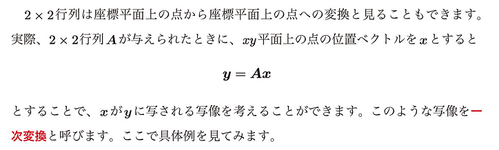
  - 行列Xに対応する一次変換で空間全体を写すと、移された先はrankX次元空間になる

### 固有値
- 固有値
  - 正方行列Aについて、ベクトルv(!=O)とスカラーλが次を満たす時、vをAの`固有ベクトル`、λを`固有値`と呼ぶ
  - `Av = λv( = λIv)`(ゼロベクトルOの時は自明に成り立つ)
  - 上記より、`(A-λI)v = 0`で、`(A-λI)`が正則行列だと両辺に逆行列をかけて`v = 0`になってしまうので、非正則である必要がある
  - 固有ベクトルは、k倍しても成り立つことから代表的なものを指しがち
  - 固有値は実数とは限らない
- 対角化
  - 正方行列Aに対して行列Vと対角行列Wを用いて`A = VWV^-1`を表すこと
  - すべての正方行列でできるわけではない

### 直交行列
- 直交行列
  - `U^T U = I`を満たす正方行列のこと
  - 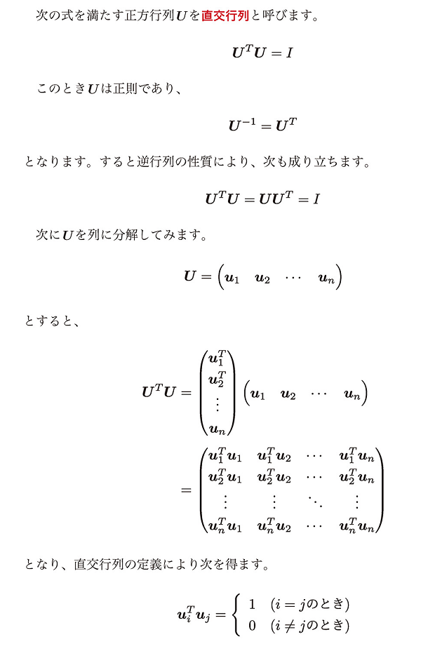
  - ベクトル`v, u`に対して、`u^T v = Uu^T Uv`
    - 内積を保存する性質
- 正規直交性
  - 直交行列の重要な性質
  - `ui^T ui = ||u|| = 1`: 正規性
  - `ui^T uj = 0(i != j)`: 直交性

### 対称行列
- 対称行列
  - `A^T = A`を満たす行列のこと
  - 対称行列の固有値は必ず実数である
  - 直交行列を使って対角化ができる
    - 対称行列Aについて、`U^-1 AU = U^T AU`が対角行列となるような直交行列Uが存在する
- 半正定値
  - n次対称行列Aが半正定値であるとは、任意のベクトル`x∈R^n`について、`x^T Ax ≧ 0`が成り立つこと
  - 半正定値である条件は固有値がすべて0以上であること
- 正定値
  - 任意のベクトル(!= O)`x∈R^n`について、`x^T Ax > 0`が成り立つこと
  - 正定値である条件は固有値がすべて正であること
- 半負定値
  - 任意のベクトル(!= O)`x∈R^n`について、`x^T Ax ≦ 0`が成り立つこと
  - 半負定値である条件は固有値がすべて0以下であること
- 負定値
  - 任意のベクトル(!= O)`x∈R^n`について、`x^T Ax < 0`が成り立つこと
  - 負定値である条件は固有値がすべて負であること

## 微積分
### 極限
- `n→∞`で近づく値(0など)を極値(極限値)、∞を発散という
- `(-1)^n*n`など、収束も発散もしない場合は振動という
- xを数直線上で右からに近づけることを`x→a+0で表す`(右極限)
- f(x)がx=aにおいて連続である
  - x=aが定義されていて、右極限も左極限もf(a)であること
  - 全ての多項式関数は連続である
  - (x!=1)のように、定義域外で連続であるかどうかは問わない

### 指数関数
- べき乗
  - `a^x` のようにaを累乗したもの(a>0)
  - べき乗計算では正の数のみを考える決まりになっている
  - 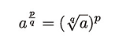
- e
  - 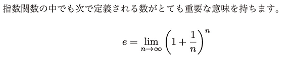
  - `自然対数の底(ネイピア数)`と呼ばれる
  - 2.7182...(無理数)
  - `e^x` は `exp x` と表されることがある

### 対数関数
- `a^x = b`(a>0,a!=1,b>0)のとき、以下で定義される
  - `x = log.a b`
  - 上記log.a bは、aを底とするbの`対数`
  - 底を何乗するとbになるか？
- 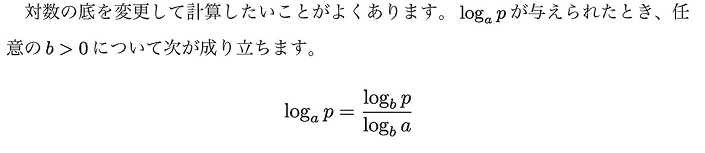
- 底がeである対数を自然対数と呼ぶ

### 微分
- 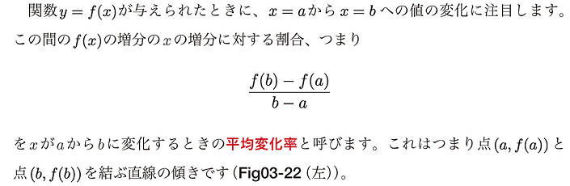
- 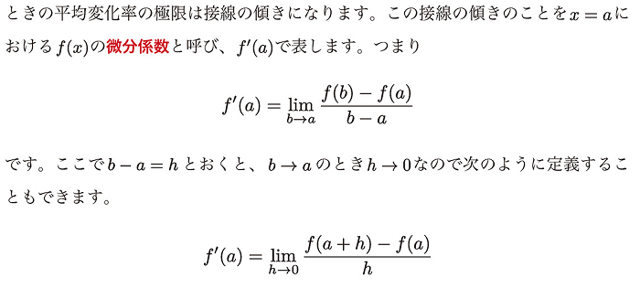
- 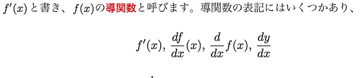
  - 導関数の表記
  - 導関数を求めること: 微分
- 二項定理
  - 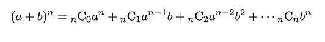
  - `nCk = n! / k!(n-k)!`
- 
- 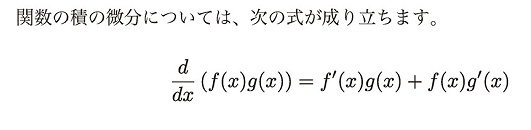
- 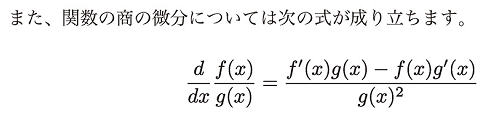
- (n)階導関数・高階導関数
  - 導関数の導関数の...
  - 無限回微分可能である関数を`滑らか`であるという
    - 任意の多項式関数は滑らか
      - 0は何度でも微分して0にできるから
- 合成関数
  - `y=f(w), w=g(x)`のとき、`y=f(g(x))`のこと
  - 合成関数の導関数: `dy/dx = dy/dw * dw/dx`
- 逆関数
  - `y=f(x)`について、`x=g(y)`のこと
  - 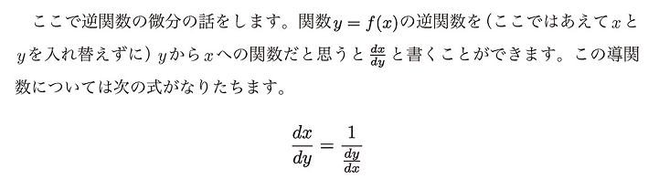
  - 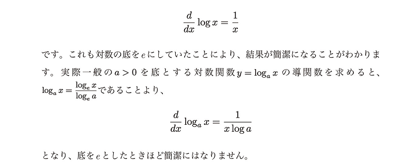

### 積分
- 不定積分
  - `∫f(x)dx = F(x) + C`: 原始関数、不定積分(Cは定数)
- 定積分
  - 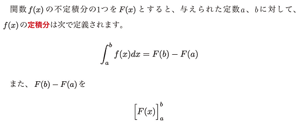

### 偏微分と勾配
- 偏導関数
  - 2変数関数 `z=f(x,y)`について、xについて微分(yを定数とみなす)したものを、xについての偏導関数という
  - `∂/∂x`, `fx(x,y)`と表記される
- 偏微分
  - 偏導関数を求めること
  - 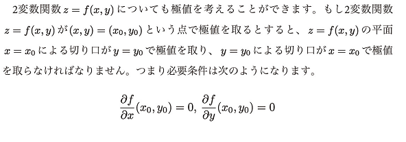
- 勾配
  - `∇f`(ナブラ)と表される
  - n変数関数`y = f(x1, x2, ..., xn)`における勾配
    - 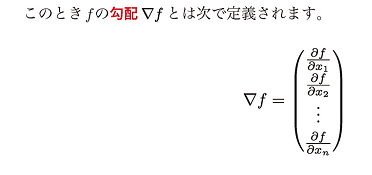
  - 関数fがxで極値を取るための条件は、`∇f(x)=0`(必要条件)
  - 勾配によって生成された連立方程式を解けば極値が求まる？
- 2階偏微分
  - 極地を取るための必要十分条件を考える上で必要
  - 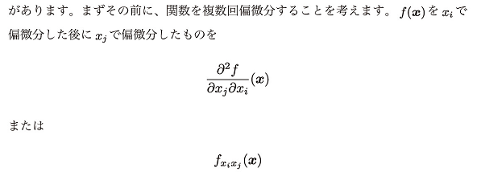
- ヘッセ行列
  - 多変数関数fが`∇f(x)=0`となる点で極値を取るかの判断(十分条件)に必要
  - ヘッセ行列が正定値: 極小
  - ヘッセ行列が負定値: 極大
  - 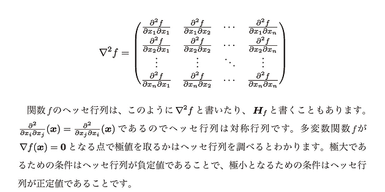
- 二次形式
  - n次対称行列Aに対して`f(x)=x^T Ax`で定義されるもの