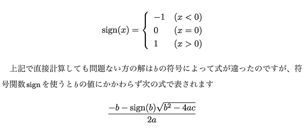
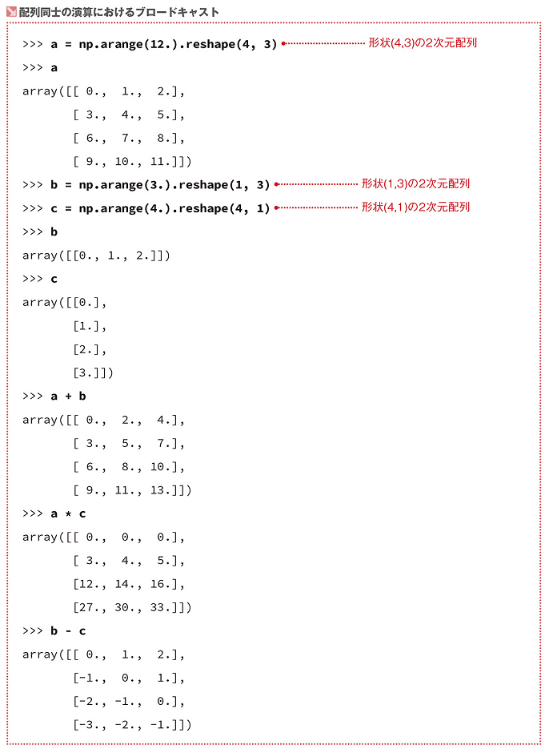
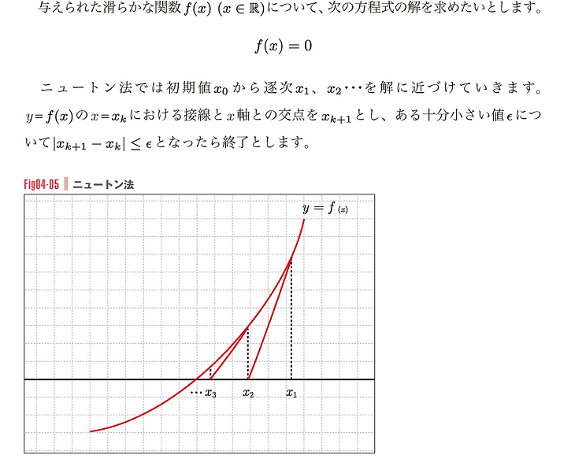

# 1. 数値計算の基本
## 誤差
- 約17桁程度までは正確に計算されるが、それ以上になると誤差が出る
- 誤差による無限ループなどに注意
- 条件式などに使用する場合は、十分に小さい数ε(イプシロン)と誤差を比較する手法が主流
```python
eps = 1e-10
s = 0
while abs(s - 1.) > eps:
    print(s)
    s += 0.1
```

## 演算による桁落ち
- 絶対値の近い数の引き算は、有効桁数が8桁ほどに下がる
  - そういうのは極力しないようにする
  - 符号関数`sign(x)`によって問題ない方の2次方程式の解の計算
  - 
  - 
  - 
- 符号関数`sign`はNumpyで定義されている
- signを使ったりする方法を`数値的に安定な解法`と呼ぶ

## 数値範囲の考慮
- ソフトプラス関数
  - `softplus(x) = log(1 + e^x)`
  - xが十分に大きいと`softplus(x)≒x`で近似される
- `inf`
  - 無限大(pythonの浮動小数点で扱える範囲を超えて大きい値)
- 

## まとめ
- 
  - 計算したい数式と数学的に同値な式を思いつけるかが鍵

# 2. Numpyの基本
 慣習
```python
import numpy as np
```

* Numpy例
```python
# e^2
np.exp(2)
# log e
np.log(np.e)
# sinπ
np.sin(np.pie)
# √3
np.sqrt(3)
```

## Numpyの配列
* ndarray: NumPyの配列クラス
* 要素の型は同じである必要あり

### `np.array()`
- 配列の初期化
- 基本的な操作はPythonのリストと大体同じ

### `np.arange()`
```python
# array([0,1,2,3,4])
b = np.arange(5)
# array([1., 1.2, 1.4, ..., 2.8])
c = np.arange(1, 3, 0.2) # ステップを0.2にする
```

### `np.dtype`
- int64
- float64
- etc...
```python
# array([1., 2., 3.])
d = np.array([1, 2, 3], dtype=np.float64)
# array([0., 1., 2., 3., 4.])
e = np.arange(5.)
```

## 2次元配列
```python
a = np.array([2, 3, 4], [5, 6, 7], dtype=np.float64)
"""
2次元配列
>> array([
    [2., 3., 4.],
    [5., 6., 7.]
    ])
"""

a[0, 1] # 0行1列
# >> 3.0

a[:, 1] # 第1列のすべての要素
# >> array([3., 6.])
```
* 数学で言うところの「次元」と配列についての「次元」は意味合いが違うので注意

## 配列のデータ属性
```python
a = np.arange(15.).reshape(3, 5) # 3行5列の2次元配列に変換
# >> array([
#     [0., 1., 2., 3., 4.],
#     [5., 6., 7., 8., 9.],
#     [10., 11., 12., 13., 14.]
#     ])

a.shape
# >> (3, 5) 配列の形状

a.ndim
# >> 2 配列の次元数

a.size
# >> 15 要素数
```

## reshapeメソッドと形状の変更
```python
a = np.arange(16.)
# -1 で列の省略 16要素を4行なので自然に4列になる
c = a.reshape(4, -1)
# 1次元配列に戻す 下記2行は同じ結果
c.ravel()
c.reshape(-1)

b = np.arange(4.)
# -1 で行の省略 下記3行は同じ結果
b.reshape(-1, 1)
b[:, np.newaxis]
b[:, None]
# >> array([
#     [0.],
#     [1.],
#     [2.],
#     [3.]
#     ])
```
* ベクトルと列数1の行列は数学的には同一視できるが、Numpyでは別物扱い


## その他の配列の操作
- `np.zeros((m, n))`
  - 要素が全て0である配列の作成
- `np.ones((m, n))`
  - 要素が全て1である配列の作成
- `np.empty((m, n))`
  - 任意の要素を持つ配列の作成
  - 結果は環境依存
  - メモリ上のゴミを拾ってくる可能性がある
- `np.linspace(m, n, l)`
  - 等差数列を要素として持つ配列の作成
  - グラフの描画に便利
```python
# 0から1の等差数列、要素10個
np.linspace(0, 1, 10)
# >> array([0., 0.11111111, 0.22222222, ..., 1.])
```

## 行列の連結
- `np.r_[a, b]`(a, bは行列)
  - 行列を`縦`方向に連結する
  - 関数でなくクラス
- `np.c_[a, b]`(a, bは行列)
  - 行列を`横`方向に連結する
  - 関数でなくクラス
- 1次元配列は`縦ベクトル`のように扱われる
  - 1次元配列同士を連結して1次元配列にしたい場合は、`c_`ではなく`r_`
- 連結する配列の形状が合わないとエラー

# 3. 配列の基本計算
- `sum()`
  - 合計
  - 2次元配列の場合
    - 引数なし: 全要素の合計値
    - `(axis=0)`: 列ごとの合計値(戻り値は配列)
    - `(axis=1)`: 行ごとの合計値(戻り値は配列)
- `mean()`
  - 平均
- `max()`
  - 最大値
- `min()`
  - 最小値

## ブロードキャスト
* 配列を含む演算を行う場合に次元や形状を自動的に調整する機能
* 
* 配列に関数を作用させると全要素に対して関数が適用される
  * 関数だけでなく演算子にも使える(配列に`+3` すると全要素に`+3`されるなど)
* ブロードキャストされる関数を`ユニバーサル関数`と呼ぶ
* forとかより`計算速度が早い`
* bool値の配列を配列の角括弧の中に入れると、Trueだけを抜き出す
  * 
* 配列の中をfilterして要素を抜き出すことが簡単にできる
  * 
  * 「かつ」は`&`、「または」は`|`
    * 使うときは条件に括弧が必要

## 配列の演算
* 同じ形状の場合、配列同士の四則演算は各要素同士の四則演算
* `np.dot(u, v)`
  * ベクトルの内積
  * 各要素の積の和なので、`(u*v).sum()`でも同じ
  * 2次元配列同士で使用した場合、行列の積とみなす
* `a.dot(b)`(a,bは2次元配列)
  * `np.dot(a, b)`と同じ
  * `a@b`でも同じだが、Python3.5で導入されたものであまり使われていない？
* 複雑なブロードキャスト
  * 
  * 形状の違う配列同士の演算においてもブロードキャストするときある

# 4. 疎行列
* `疎行列`
  * ほとんどの要素が0であるような行列のこと(↔`密行列`)
  * 機械学習ではよく出てくる
  * 普通に2次元配列を使うとメモリや計算量の観点から効率が悪い
  * `SciPy(サイパイ)`ライブラリに疎行列専用のデータ型がある
    * サイズが大きい疎行列を扱う時に威力を発揮
```python
# 疎行列の型
from scipy import sparse

# 行列のサイズを指定して空行列を作成
a = sparse.lil_matrix((4, 5))
# 代入
a[0, 1] = 1
# ...
# 通常の行列に変換(大きなサイズを扱うときは非推奨)
a.toarray()
```
* `a.tocsr()`(aは行列)
  * `csr_matlix`型に変換
* `a.tocsc()`(aは行列)
  * `csc_matlix`型に変換
* `csr_matlix`, `csc_matlix`のほうが計算早い
  * 疎行列による計算には基本こっち使う
  * 値の設定は`lil_matrix`でしかできない
  * `csr_matlix`: 行を取り出す操作が高速
    * `getrow(n)`メソッドで指定した行の取り出し`
  * `csc_matlix`: 列を取り出す操作が高速
    * `getcol(n)`メソッドで指定した列の取り出し`
* 疎行列を扱う際の一般的な流れ
  * 
* 密行列、疎行列を問わず、行列に対して`a.T`(aは行列)で転置を取れる
  * `csr_matlix`, `csc_matlix`は転置でお互いになる

# 5. NumPy/SciPyによる線形代数
## 逆行列の計算
* `np.linalg.inv(a)`(aは行列)
```python
a = np.array([
    [3, 1, 1],
    [1, 2, 1],
    [0, -1, 1]
    ])

# linalgモジュールの関数 inv()
np.linalg.inv(a)
# >> 逆行列出る
```

* `np.linalg.solve(a, b)`(a, bは行列)
  * 数値的安定かつ高速
  * 

## LU分解

* 与えられたn次正方行列を以下の行列を使用して`A = PLU`で表すこと
  * 置換行列P
  * 対角成分が1の下三角行列L
  * 上三角行列U

* `np.linalg`ではなく`scipy.linalg`を使う

# 6. 乱数
* 乱数を扱うためのモジュールはPython標準の`random`とNumpyの`np.random`があるが、後者のほうが多機能

## `np.random.rand()`
* [0, 1) の範囲の浮動小数点を返す
* 引数を指定すると配列を返す
  * `np.random.rand(5)`
  * `np.random.rand(3, 4)`

## `np.random.randint(n)`(nは整数)
* [0, 引数) の範囲の整数を返す
* [引数1, 引数2) の範囲の整数を返す
* 引数sizeを指定すると配列を返す
  * `np.random.randint(5)`
  * `np.random.randint(3, size=(3, 3))`

## 再現性と乱数の種
* 乱数の種(シード)
  * どの乱数列を選ぶのかにあたるもの
  * 計算機内の数列発生装置を同じシードで初期化すれば同じ乱数列が得られる

* `np.random.seed(n)`(nは整数)
  * シードを設定する
  * グローバルな乱数生成器の初期化であることに注意
```python
np.random.seed(10)
np.random.rand(5)
# >> hoge

np.random.seed(10)
np.random.rand(5)
# >> hoge(一致)

np.random.seed(100)
np.random.rand(5)
# >> fuga(変化)

np.random.seed(100)
np.random.rand(5)
# >> fuga(一致)
```

`np.random.RandomState(n)`(nは整数 seed)
* `np.random`モジュールの大体の関数ある
* `RandomState`クラスをインスタンス化して乱数生成のメソッドを呼ぶと、他の状態とは独立に再現性のある乱数列を得ることができる(グローバルでない)
* 機械学習において、同じ訓練データに対して毎回異なるモデルが生成されるのは困ったりする


# 7. データの可視化
* `Matplotlib`を使ったデータの可視化
## 全般
* `show()`前に複数のグラフ関数を使えば複数グラフを描画できる

## 折れ線グラフ
* `plot(x, y, ...)`
  * 折れ線グラフの関数
  * color
    * r: 赤
    * g: 緑
    * b: 青
    * k: 黒
  * linestyle
    * --: 破線

```python
import numpy as np
# 慣習
import matplotlib.pyplot as plt

x = np.array([0, 1, 2, 3])
y = np.array([3, 7, 4, 8])

plt.plot(x, y, color="r")
# グラフの表示
plt.show()
```
python数理最適化1

## 散布図
* `scatter(x, y, color="")`

## 曲線のグラフ
* y=x^2 の場合
```python
import numpy as np
import matplotlib.pyplot as plt

# 範囲[-5, 5]を等間隔に刻んで300個の点の数値を得る(等差数列)
# 300個じゃなくてもいいけどデカすぎると計算遅い
x = np.linspace(-5, 5, 300)
# ブロードキャスト
y = x ** 2

plt.plot(x, y, color="r")
plt.show()
```

## ヒストグラフ
* `hist(l, n, ...)`
  * `l`: 数値で構成されるシーケンス
  * `n`: ピンの数
    * 数値だけでなく、区間を明示的に指定することも可能
    * hist(l, np.arrange(15, 55, 2)) など

```python
# サイコロを10回振った目の合計を1000回計算した時の合計値の分布
import numpy as np
import matplotlib.pyplot as plt

np.random.seed(0)
l = []
for _ in range(1000):
    l.append(np.random.randint(1, 7, size=10).sum())

# ヒストグラフ描画
plt.hist(l, 20, color="gray")
plt.show()
```


## 複数のグラフを並べて表示する
* `subplot(m, n)`
  * m行 n列にサブプロットを並べる
  * 戻り値は`fig`, `axes`
    * axes: サブプロットの配列 描画や設定ができる
* `pyplot()`との微妙な違いが気になるなら、サブプロット1つでも`subplot()`を使うという手もある
  * 引数指定しないとサブプロットは1つ、`axes`は`ax`になる(配列でない)

```python
import numpy as np
import matplotlib.pyplot as plt

x = np.linspace(-5, 5, 300)
sin_x = np.sin(x)
cos_x = np.cos(x)

# axes: matplotlib.axes.Axes のインスタンスのリスト
# pyplot配下の関数群と大体同じだがちょっと違うので注意
fig, axes = plt.subplots(2, 1)
# y軸の描画範囲を設定
axes[0].set_ylim([-1.5, 1.5])
axes[1].set_ylim([-1.5, 1.5])

axes[0].plot(x, sin_x, color="r")
axes[1].plot(x, cos_x, color="k")

plt.show()
```


## 等高線の描画
* 楕円の方程式: `x^2/a^2 + y^2/b^2 = 1`


* `meshgrid(x, y)`
```python
import numpy as np

x = np.array([1, 2, 3])
y = np.array([4, 5, 6])

xmesh, ymesh = np.meshgrid(x, y)
xmesh
# >> array([
#     [1, 2, 3],
#     [1, 2, 3],
#     [1, 2, 3]])
ymesh
# >> array([
#     [4, 4, 4],
#     [5, 5, 5],
#     [6, 6, 6]])
```


* `contour(x, y, z, colors="hoge", levels=[m, n, ...])`
  * x, y: 軸
  * z: グリッド天井の関数の評価値(値)
  * levels: 等高線を描く関数の評価値
    * これにzが一致する部分だけ線が引かれる

* `contour(x, y, z, colors="hoge", levels=[m, n, ...])`
  * 関数の評価値によって領域を塗り分けたいときはこっち
  * colorsとlevels必須？

* `x^2 + y^2/4 = k`において、kを固定すると楕円
* k=1, 2, 3, 4, 5の場合

* `colors`に浮動小数点を与えるとグレースケールでの濃さを与える
  * 0.0が黒、1.0が白


# 8. 数理最適化
* 数理最適化問題
  * 与えられた制約の中で、ある関数の値を最大化(最小化)する問題のこと

## 線形計画問題
* 線形計画問題
  * 目的関数も制約式も1次式(線形)である最適化問題のこと
  * 要はつるかめ算？
  * 機械学習のアルゴリズムではあまり出ない
* 例題
  * 
  * 方程式の条件を以下のように記述する
  * 
  * 左: 制約の領域、右: 制約内で最適解を探すグラフ
  * 

* Maximize(Minimize): 目的関数
  * 最大化、最小化に向けて最適化したい関数
* Subject to: 制約式
  * 条件
* 実行可能解
  * 制約式を満たすような変数の値
* 最適解
  * 目的関数を最適化する変数
* 最適値
  * 最適解を代入した時の目的関数の値

### 線形計画法の一般型
* 線形計画法は2変数ではなくn変数のときでも考えることができる
* n次元ベクトルx
* 
* 

### `scipy.optimizelinprog`
* 線形計画問題の`ソルバ`の1つ(最小化専用？)
  * 数理最適化問題を得システムを`ソルバ`という
  * 標準形における値は以下で指定される
    * c: 引数c
    * G: 引数A_ub
    * h: 引数b_ub
    * A: 引数A_eq
    * b: 引数A_eq
    * すべての変数の範囲: 引数bounds


* bounds(0, None): 下限0, 上限なし
* 計算後、`sol.x`で最適解、`sol.fun`で最適値取得

## 2次計画法
* 2次計画問題
  * 線形計画問題の2次関数版

### cvxopt
* 2次計画問題用のPythonライブラリ
  * Anacondaに含まれていないので別途インストールの必要あり
* cvxoptにおける制約条件なしの2次計画問題の標準形
  * 
    * `f(x, y)`はx^2 + xy + y^2 + 2x + 4y
* 行列やベクトルは独自の方を使用しているため、Numpyの配列を使うには変換する必要がある

* `cvxopt.solvers.qp(P, q, A, b, G, h)`
  * 2次計画法の関数(最小化専用？)
  * P, qは標準形の係数
  * 
  * 
  * 返り値は辞書型
    * キーxで最適解
    * キーprimal objectiveで最適値
  * 入力できる制約条件
  * 
  * 
* `cvxopt.matrix()`
  * Numpyの配列→cvxoptの配列
  * 最適解は`(qpの返り値)`

### まとめ


## 勾配降下法(最急降下法)
* 関数の勾配(傾き)`∇f`を元に最小値を探す方法
* 値が小さくなる(大きくなる)方向にxを少しづつずらして最適解を探す

### 2変数関数における例


### n変数関数におけるアルゴリズム

* パラメータα: 最適値の探索時にどのくらい大きく移動するかを表すもの
  * 問題によって実験的に決められる
  * 大きすぎると計算が発散してしまい、小さすぎるとなかなか収束しない
* パラメータε: 計算の終了条件
  * 小さくすればするほど正確に最適解を求められるが、計算に時間がかかる
* 理想としては`∇f(x) = 0`となるxを見つけたいが、計算が不安定になって無限ループに陥りやすくなる

### 実装
* 変数の数が一般(なんでも)の場合に解ける
```python
import numpy as np

class GradientDescent:
  def __init__(self, f, df, alpha=0.01, eps=1e-6):
    # 最小化したい関数
    # n次元ベクトル(長さnの1次元配列)を引数に取り、
    # 浮動小数点を返す
    self.f = f
    # 最小化したい導関数
    # n次元ベクトルを引数に取り、n次元ベクトルを返す
    self.df = df
    # アルゴリズムにおけるα
    self.alpha = alpha
    # アルゴリズムにおけるε(終了条件)
    self.eps = eps
    self.path = path

  def solve(self, init):
    # 初期値
    x = init
    path = []
    grad = self.df(x)
    path.append(x)

    # ∇fのL2ノルムがeps以下の時に終了
    while (grad**2).sum() > self.eps**2:
      # x[k+1] = x - α∇f(x[k])
      x = x - self.alpha * grad
      grad = self.df(x)
      path.append(x)

    self.path_ = np.array(path)
    # 最適解
    self.x_ = x
    # 最適値
    self.opt_ = self.f(x)
```


## ニュートン法
* 与えられた方程式の解を数値的に求める手法
* 最適化問題においても導関数が0になる点を求めるのは最適値を求めることになるので、ニュートン法が利用できることがある
* y


* ニュートン法の公式


* n変数におけるヤコビアン行列
  * 更新式は上記と同じ


* 捕捉・引数に関数だけでなく導関数も取る理由


## ラグランジュ未定乗数法
* 以下のような手法をラグランジュ未定乗数法と呼ぶ

* L: `ラグランジュ関数`
* λ: `ラグランジュ乗数`

### なぜラグランジュ関数の勾配を求めると解けるのか？
* 下図の通り、∇f - -λ∇g(λは係数)
  * よって`∇f + λ∇g = ∇L = 0`
  * `∂L/∂λ = g(x, y)`である
    * `g(x, y) = 0` が極値の条件？

* 例題について
  * 上図より、`∇f = -λ∇g(∇f + λ∇g = 0)`
  * 接点は`g(x, y) = 0`上の点である
  * よって下図になる
* 
  * 方程式解けばおｋ


### 一般の2変数最適化問題の解き方
* 等号制約、不等号制約に限らない最適解の求め方
* 
  * `λg(x,y) = 0`
    * `λ = 0`の場合
      * `L(x,y,λ) = f(x,y)`
      * `g(x,y)`の範囲で`∇f(x,y) = 0`となる点を求める
    * `g(x,y) = 0`の場合(等号制約)
      * 点(x,y)は制約を表すg(x,y)の領域の境界線上にある
* 制約条件`λg(x,y) = 0, λ≧0, g(x,y)≦0`は`Karush-Kuhn-Tucker条件`と呼ばれる
  * 略して`KKT条件`

* n変数関数かつ複数の制約条件でも考えられるよ(p260参考)

# 9. 統計
## 統計基本量
* 統計基本量
  * データ分布の状況を要約して表す数値のこと

### 平均値

* よく使われるよ
* `[Numpy配列].mean()`で計算できる

### 分散・標準偏差
#### 分散
* 
  * xは平均

#### 標準偏差
* 分散の正の平方根
* データが平均値からどのくらい広がっているか(=どのくらい散らばっているか)を示す指標
  * 分散はこれを2乗したものなので、意味合い的には同じ
* `[Numpy配列].std()`で計算できる

### 共分散
* 
  * x,yは平均
* 2つの数の相関を表している
  * 共分散が大きい → (xi, yi)において、xiの大きさとyiの大きさに比例関係がある傾向にある(xiが大きければyiも大きい)
  * 共分散が負の小さい値 → x, yの大小に反比例傾向がある

#### 相関係数
* 各値(x,yなど)の標準偏差(散らばり)が大きいと共分散も大きくなる傾向がある
  * 純粋に相関を見たいときはｍ共分散を各値の標準偏差で割ったもの`(相関係数)`を考えることが多い
* 
  * 1から-1までの値を取る

#### 共分散行列

* x1 = (x11, x12, ..., x1n)T, ..., xm における共分散行列


## 正規分布と確率密度関数
### 確率変数
* `X`で表される
* 確率的にさまざまな値を取る変数
* 確率変数Xがある値を取る確率は`P(Xについての条件)`で表される
  * 例(さいころの目): P(X=1) = 1/6
  * カッコ内は等式でなくても良い

#### 離散型確率変数
* サイコロの目のように飛び飛びの値を取る確率変数のこと
* 確率変数がとりうるすべての値の和が1になる

#### 離散一様分布
* 確率変数Xが1からnまでの値をとりえて、それぞれの確率が1/nであるもののこと(サイコロとか)

#### 正規分布
* 統計でよく使われる関数
  * 実世界では近似的に正規分布に従う事柄も多い
  * `N(μ,σ)`で表されることもある


* `確率密度関数`
  * ある範囲の値を取る確率が、その積分で計算できるような関数のこと

* `scipy.stats.norm.pdf(x)`
  * 正規分布の確率密度関数を計算する関数
  * μ=0, σ=1として計算する
  * 引数`loc`でμ、`scale`でσを指定できる

* 正規分布に従う事象の例
  * 
  * 正規分布において`P(X=a) = 0`であるのは、コインの例でいうと、無限枚のコインが何枚表か完全に当てるのはほぼ0だから

#### 累積分布関数
* 正規分布に限定せず一般の確率密度関数fに対して定義できる概念


* `scipy.stats.norm.cdf(x)`
  * 正規分布の累積分布関数を計算する関数
  * μ=0, σ=1として計算する
  * 引数`loc`でμ、`scale`でσを指定できる

#### 確率変数における平均と分散
* `E(X)`: 確率変数における平均(期待値)
* 
  * 連続型の区間は∞～-∞ 誤植？
  * `E(X + Y) = E(X) + E(Y)`
  * `E(kX) = kE(X)`(k∈R)

* `V(X)`: 確率変数における分散
  * 確率変数の値を取り出すことを続けたときの値のばらつきを表している
* 
  * 離散型、連続型で共通
* 

* おまけ(不定積分の極限)
  * 