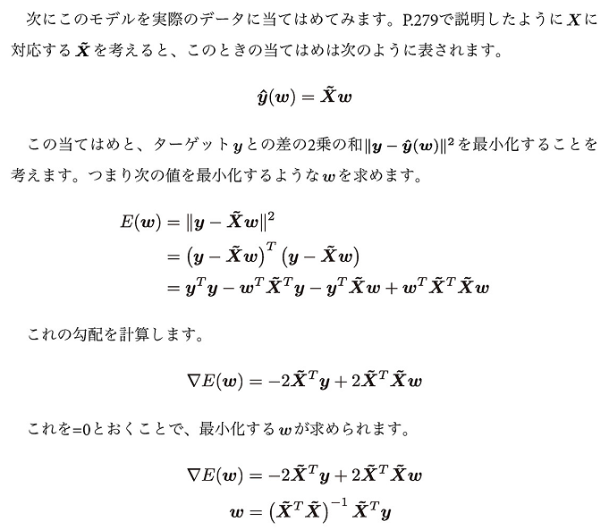
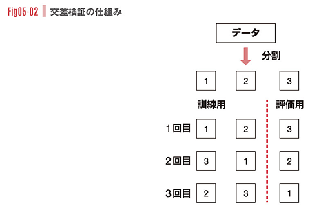

# 1. 準備
* 本書籍における定義もあるので一般化しすぎないほうがいいかも

## 入力データについて
* 教師あり学習における訓練データ
  * 入力訓練データX: m行n列の行列
  * 出力訓練データy: ザイズ(要素数)がmのベクトル
* `サンプル`
  * 入力データのi行目と出力訓練データのi個目を取り出したもの
  * 調査対象の個体に対応している(ワインとか)
  * サンプルごとの特徴量の次元: `d`
* xi: 入力訓練データXのi行目(サンプルi)を縦ベクトルにしたもの

### 重み

* 線形和で行列データが与えられることもある
* 重みに掛けられるベクトルvに~(チルダ)が付いているかどうかで定数項ありのデータか否かを判別する


### 用語
* `特徴量行列`
  * 入力訓練データX の一般名
  * 教師あり、なしどちらでも使う
* `特徴量ベクトル`
  * Xの中のサンプル xi
* 教師ありデータではX,yが訓練データ、教師なしはXのみ
* `回帰`
  * 教師あり学習の中でも、特に出力訓練データの値の大小に意味がある場合(ワインの品質とか)
    * 回帰の時の出力訓練データを`ターゲット`という
* `分類`
  * 出力訓練データの値の大小に意味がない場合(あやめの花の分類とか)
  * 出力訓練データを`ラベル`という

### インターフェース
* 教師あり学習

```python
# 機械学習アルゴリズムを実装したクラス インスタンス化
model = Algorithm(parameters)
# X: 特徴量行列、 y: ターゲット(ラベル) 学習
model.fit(X, y)
# X_test: 評価用データ 評価用データについての予測値を取得
y_predicted = model.predict(X_test)
```

* クラスタリング(教師なし学習)
  * 点群のかたまりを見つけ出すタスク
  * 学習結果は、各点がどのクラスタに属するかという識別データ(ラベル)になる

```python
# インスタンス化
model = Algorithm(parameters)
# 学習(教師なしなのでyはなし)
model.fit(X)
# ラベルの取得
clusters = model.labels_
```

* 次元圧縮(教師なし学習)
  * 多次元空間上の点群をて異次元空間に射影する
  * 点群からどの方向に射影すべきかを学習し、その後に新たに与えられた点群を射影する

```python
# インスタンス化
model = Algorithm(parameters)
# 学習(教師なしなのでyはなし)
model.fit(X)
# 射影
Z = model.transfer(X)
```

# 2. 回帰
## 特徴量ベクトルが1次元の場合
### 原点を通る直線による近似
* `最小二乗法`
  * 直線(y=ax)で近似した時の誤差の2乗の和を最小化する
  * 近似としてよく使われる手法


### 一般の直線を通る直線による近似
* 一般の直線: y=ax+b


### 特徴量ベクトルが多次元の場合
* `線形回帰`
  * 式
  * 
    * 
    * 同じ
  * (x0,...,xd)^T: 入力変数
  * (w0,...,wd)^T: パラメータ
    * 1次元の場合、w0: b、w1: a
  * y: ターゲット
  * ε: ノイズ
* wの計算式
  * 

* 線形回帰の実装
  * linearreg.py
```python
import numpy as np
from scipy import linalg

class LinearRegression:
  def __init__(self):
    self.w = None

  def fit(self, X, t):
    # shape[0]で行数を取得し、n行1列の1行列を生成
    # c_でXと横連結し、~Xに相当する行列を生成
    Xtil = np.c_[np.ones(X.shape[0]), X]
    # ~X^T ~X
    A = np.dot(Xtil.T, Xtil)
    # ~X^T y
    b = np.dot(Xtil.T, t)
    # 1次関数を解く関数 bはn行1列なので1次関数とみなせる？
    self.w_ = linalg.solve(A, b)

  def predict(self, X):
    # 配列の次元(Pythonにおける)数
    # ベクトルの時？
    if X.ndim == 1:
      # 1行にする(=1行ベクトルにする？)
      X = X.reshape(1, -1)
    Xtil = np.c_[np.ones(X.shape[0]), X]
    # ~X^T w
    return np.dot(Xtil, self.w_)
```

* 乱数を使った人工データによる上記モデルの実験
  * 訓練入力データの次元数は2, 100個のサンプル(`n`)を生成
  * 線形和`w0 + w1x1 + w2x2`について、w0=1, w1=2, w2=3としている
* `np.random.randn()`
  * 正規分布に従う乱数を要素に持つ行列を生成する
```python
# 上記で作成したモデル
import linearreg
import numpy as np
import matplotlib.pyplot as plt
from mpl_toolkits.mplot3d import axes3d

n = 100
scale = 10

np.random.seed(0)
# 要素が乱数のサイズ100*2の行列を生成 0から10までの値
X = np.random.random((n, 2)) * scale
w0 = 1
w1 = 2
w2 = 3
# 線形和 + 乱数
y = w0 + w1 * X[:, 0] + w2  * X[:, 1] + np.random.randn(n)

# 作成したモデルのインスタンス
model = linearreg.LinearRegression()
model.fit(X, y)
print("係数：", model.w_)
print("(1, 1)に対する予測値：", model.predict(np.array([1, 1])))

xmesh, ymesh = np.meshgrid(
  np.linspace(0, scale, 20),
  np.linspace(0, scale, 20)
  )

zmesh = (
  model.w_[0]
  + model.w_[1] * xmesh.ravel()
  + model.w_[2] * ymesh.ravel()
 ) * reshape(xmesh.shape)

fig = flt.figure()
ax = fig.add_subplot(111, projection='3d')
ax.scatter(X[:, 0], X[:, 1], y, color="k")
ax.plot_wireframe(xmesh, ymesh, zmesh, color="r")
plt.show()
```


* `RMSE(Root of Mean Square Error)`: 平均二乗誤差のルート
  * 予測の評価によく使われる
  * このような指標値は他モデルとの優劣を測るために使用する どれくらいだと良いのかは場合による


* `ホールド・アウト検証`
  * データを訓練用と評価用に分け、訓練データで学習し、評価用データをうまく予測できているかを評価する手法
  * 機械学習アルゴリズムの性能評価として共通で用いられるもの
  * 既知のデータのみから未知のデータを予測する、機械学習システムの目標としている状況を擬似的に作り出している

# 3. リッジ回帰
* `リッジ回帰`
  * 線形回帰で最小化する目的関数にパラメータの大きさ(L2ノルム)の項を足したもの
  * 
  * `λ||w||^2`: `正規化項`
  * 正規化項が加わったことにより、点群を線形に維持するだけでなく、できるだけwのL2ノルムが小さい方がよくなる
  * λ: `ハイパーパラメータ`
    * wの大きさをどのくらい重視するかを表す定数

* 
  * 上が普通の線形回帰、下がリッジ回帰
  * 上の方が点が増えるに付き直線の傾きが大きく変化している
  * リッジ回帰では比較的はずれ値から受ける影響が少ない
    * サンプル数が少ないときでも例外的なデータからの影響が少ない(正規化項の効果)
    * いい事かどうかは場合による

## ハイパーパラメータとチューニング
* `ハイパーパラメータ`
  * モデルが学習を始める前にあらかじめ値を決め、ずっとそのまま変化しない値
  * 他の変化するパラメータがどのように変化していくのかを決定するもの
  * ひたすらいろんな値を試してチューニングするしかない

# 4. 汎化と過学習
## 多項式回帰における例
* `多項式回帰`
  * 入力関数xに対して出力yがxの多項式関数で表されるモデル
  * xが1次元の場合の例(dは次数, εはノイズ)
  * 
  * x^i を xi に置き換えると線形回帰の公式になる
    * 計算的には、要素が以下になった線形回帰である
    * 
* `np.concatenate()`
  * ベクトルを横に繋いだ行列を作る
* 
  * 実践が多項式回帰、破線が線形回帰
  * 上記例においては、多項式の方が与えられた点によく当てはまっているが、性能はあまりよくない
  * **訓練データを完璧に正しく予想できるよう学習したモデルが良いとは限らない**
* `汎化性能`
  * 未知のデータをどのくらい予測できるかという性能のこと
  * 機械学習システムを利用する目的の1つ

## モデルの汎化性能
* 2乗誤差の平均
* 
  * `第1項: バイアス`
    * すべてのデータについての予測値の平均と真の値の2乗
    * 真の値が変わらない前提の場合、xにおける予測値の平均と真の値の差がどのくらいあるかを意味する
    * 観測データ(実際のデータ？)が変わった時に、平均的にどのくらい予想できるかという値
  * `第2項: バリアンス`
    * データが変化した時の予測値の分散
      * 式違うかも？分散を計算する
    * 観測データが変わった時に、平均的に予測値がばらつくかという値
  * 予測誤差の平均 = バイアス + バリアンス

### 例題


* バイアスだけ見ると線形回帰より多項式回帰のほうが良いモデルに見えるが...


* 左: 線形回帰、右: 多項式回帰
  * 多項式回帰ではx>3の範囲でバリアンス(予測と真の値の差)がばらつく
  * バイアス: 小 かつ バリアンス: 大 → 平均は真に近いが、大外しも多い
* `ax.fill_between(x, y1, y2)`
  * ２つの関数のy軸方向のx区間を塗りつぶす

## 交差検証
* (ハイパーパラメータの)`過学習`
  * テストデータについては上手く予測できるが、一般のデータについてはあまりよく予測できないような値をハイパーパラメータの値として選択してしまうこと

* `交差検証(クロスバリデーション)`
  * k分割交差検証(kは数字)
    * データをk個に分割して、そのk個のデータのうち1つをテスト用にして他を訓練用にする
    * 
    * 各回の評価が終わるとモデルは捨てられ、ゼロから学習し直し、複数回の評価の平均を全体の評価値とする

# 5. ラッソ回帰
* 正規化項として`L1ノルム`を加えたものを`ラッソ回帰`と呼ぶ
  * リッジ回帰ではL2ノルムが正規化項だった
  * 以下を最小化するwを求める
  * 

## 座標降下法(coordinate descent)
* 
* 
* 
  * x0w0 = w0であることに注目
* 
  * S(p,q)のpに当たる部分が正 = wk+
  * S(p,q)のpに当たる部分が負 = wk-
  * 

### ソフト閾値関数

* wkの更新において、wkの値は0からスタートし、一定の条件下では上記グラフの通りwkは0のままである
* 上記から、ラッソ回帰の解はほとんどの要素が0になる(疎になる)
* `スパーシティ`: 全体に対するゼロ要素の割合
  * λを小さくするとスパーシティが下がる(非ゼロが増える)
    * S(X,λ)のグラフや式より、xの絶対値がλ以下だとyは0になる
    * よって、λが大きいほど0になりやすく、スパーシティが上がる

# 6. ロジスティック回帰
* 主に二値分類(ラベルの値が2種類しかないような教師あり訓練データ)に使われるアルゴリズム
* ラベルの値が0または1の場合
  * 与えられた特徴量のサンプルx(∈R^d)に対して、ラベルyが1になる確率
  * P(Y = 1|X = x)
* ロジスティック回帰は以下の式を前提にしたモデルである
  * 
  * σ: `シグモイド関数`
    * 
  * σの中身はxについての線形関数
  * 上記式より、線形関数が大きいほど1に近づき、小さいほど0に近づく
    * ロジスティック関数は、(-∞,∞)の範囲を(0,1)の範囲に変換する役割を持つ
  * ラベルの値がyになる確率
    * 

## 特徴量行列Xからラベルベクトルyが生じる確率の計算

* ニュートン法によってE(w)の最適値を求める
  * E(w)の定義より、E(w)が最小の時P(y|X)が最大
  * よって`∇E(w)=0`(極小値)を求める
  * 上記方程式の解を求めるには、ヘッセ行列`H = ∇^2 E(w)`を計算する必要がある

### シグモイド関数の微分


### E(w)の1階微分∇E(w)


### E(w)の2階微分H(ヘッセ行列)

* Rはwに依存しているので、下記更新式でwが更新される度に計算し直す必要があることに注意

### ∇E(w)におけるニュートン法の更新式


# 7. サポートベクタマシン
* `サポートベクタマシン(SVM)`
  * 2種類のラベルが付いた点群を、ラベルに応じて超平面で分割することを考える
    * 完全に分割する場合を(`ハードマージン`)
  * マージン(超平面に一番近い点と超平面の距離)を最大化する超平面で分類することを考える手法
  * 2次元における例(超平面=直線)
  * 

## 解くべき最適化問題の導出

* 分類直線(2次元における超平面)


* マージン最大化の式
* min以降はi番目の点から直線の距離
* 式の性質上、w(0)とwのすべての要素をk倍しても最適化される式は変わらない
  * 最適解を定数倍したものも最適解になる
  * minの内部(超平面と点の距離の最小値)は1の場合のみを考えても問題ない
  * よって、最適化の式は`Maximize(w0,w) 1/||w||` のように単純化される

* 最終的な解くべき最適化問題
* 最小値が1である(全要素が1以上である)仮定が制約式として必要
* `1/||w||`の最大化 = `||w||`の最小化 = `1/2・||w||^2`の最小化
* 上記をラグランジュの未定乗数法で解く

## 最適化問題をラグランジュの未定乗数法で解く

- w0,wについて解き、計算していくとL(w0,w,a)は以下のf(a)ようにaについての2次計画問題になる

- 汎用の2次計画問題ソルバでも解けるが、問題の特性により更に効率が良いソルバもある
  - ここでは`Platt`を使用する
- 画像最後の制約式により、マージン境界線の上にある点(`サポートベクタ`)における点x(i), 係数a(i)のみを考えれば良い


- サポートベクタがどうなるかに注目すると、f(a)はほとんどのパラメータを無視でき、上記のようなアルゴリズム概要になる

### a(i)とa(j)だけを動かして他を固定して最適化する


### i,jの選択の仕方

- `argmin,argmax`: 最小値、最大値を取る時のインデックスの値


## 分離不可能な場合(`ソフトマージン`)
* 超平面により2つのクラスを完全に分離できるケースは現実には少なく、教会の周辺で複数種類の点がある程度混ざりがち
  * ある程度誤りを許容して分類することが必要
  * `スラック変数`: ε(i) >= 0 (i=1,...,n)
    * 間違いの度合いを表す(大きいほど大きく間違っている)
      * Σ(i=1~n)ε(i) が小さいほど望ましい
    * 
* 最小化すべき目的関数
  * 
  * Cは調整のための定数
    * 大きければ大きいほどε(i)の値を小さくしようという力が強く働く(=誤りへの許容度が低くなる)
    * 上記をラグランジュ未定乗数法で解く
* 
  * 得られる目的関数は分離可能な場合と全く同じ

* 
  * 解くべき最適化問題
* 

## カーネル法
* 超平面(平面上では直線)ではなく超曲面(平面上では曲線)で分類する手法を`カーネル法`という
* 
  * 分類超曲面の式
* 
  * `カーネル関数`
* 
* 
  * `RBF(放射基底関数、Radical basis function)`
    * カーネル関数の一種(よく使われる)
* 

* `LIBSVM`
  * SVMのライブラリとして最もよく使われているもの。scikit-learnの内部でも使われている。

# 8. k-Means法
* `クラスタリング`(教師なし学習)のアルゴリズムの一種
  * 特徴量行列X とクラスタの数k が入力として与えられる

## アルゴリズム

* 距離は`ユークリッド距離`を採用する


* クラスタの重心Gjを表す式
  * クラスタに所属している点の平均値
* j番目のクラスタに属する点のインデックスの集合をIjとする

# 9. 主成分分析(PCA)
## 概要
* 教師なし学習のアルゴリズムの一種であり、`次元圧縮`の手法
* 与えられたデータをより低次元の空間に射影し、射影後の点の散らばりができるだけ大きくなるようにする
  * = 元データの特徴を最もよく捉えた射影を見つける
* 特に2次元のデータに圧縮して多次元のデータを可視化するのに役立つ
* 上記から、次元圧縮後の分散を最大化することを考える

## 解くべき最適化問題

* 1次元に射影する場合
* 計算の結果、解くべき最適化問題の解は固有値λが最大の時という結果になった。

## 多次元への射影と特異値分解


わからん いつかやる